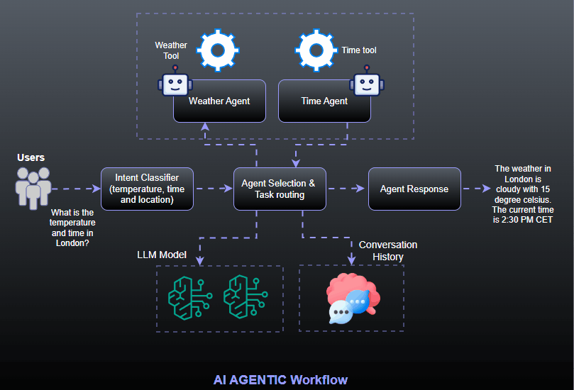

# Multi-Agent Tool



A Node.js-based multi-agent system that orchestrates different AI agents to handle weather and time-related queries using OpenAI's GPT models.

## Project Overview

This project implements an agent orchestrator that manages multiple specialized agents:
- **Weather Agent**: Provides weather information for specified locations
- **Time Agent**: Provides current time for different cities

The system uses an intelligent orchestrator to route user queries to the appropriate agent based on intent classification.

## Project Structure

```
multi-agent-ai-tool/
├── src/
│   ├── agents/
│   │   └── BaseAgent.js           # Base agent implementation
│   ├── llm/
│   │   └── llmOps.js              # LLM operations and API calls
│   ├── tools/
│   │   ├── BaseTool.js            # Base tool interface
│   │   ├── TimeTool.js            # Time-related functionality
│   │   └── WeatherTool.js         # Weather API integration
│   ├── logger.js                  # Logging utilities
│   ├── main.js                    # Application entry point
│   └── orchestrator.js            # Agent orchestration logic
├── .env                           # Environment variables
├── .gitignore                     # Git ignore rules
├── package.json                   # Node.js dependencies and scripts
└── README.md                      # Project documentation
```

## Prerequisites

- Node.js 18 or higher
- npm or yarn package manager
- OpenAI API key
- OpenWeatherMap API key

## Installation

1. **Clone the repository**
   ```bash
   git clone <repository-url>
   cd multi-agent-ai-tool
   ```

2. **Install dependencies**
   ```bash
   npm install
   ```

4. **Set up environment variables**
   
   Create a `.env` file in the root directory with your API keys:
   ```env
   OPENAI_API_KEY=your_openai_api_key_here
   OPENWEATHERMAP_API_KEY=your_openweathermap_api_key_here
   ```

   **Getting API Keys:**
   - **OpenAI API Key**: Sign up at [OpenAI Platform](https://platform.openai.com/) and generate an API key
   - **OpenWeatherMap API Key**: Register at [OpenWeatherMap](https://openweathermap.org/api) and get a free API key

## Dependencies

The project uses the following Node.js packages:

- `axios` - HTTP client for API calls
- `dotenv` - Environment variable management
- `colors` - Terminal text coloring
- `readline` - Built-in Node.js module for user input

## Usage

1. **Run the application**
   ```bash
   npm start
   ```
   
   Or for development with auto-restart:
   ```bash
   npm run dev
   ```

3. **Interact with the system**
   
   The system will greet you and wait for input. You can ask questions like:
   - "What's the weather in New York?"
   - "What time is it in Tokyo?"
   - "Tell me the weather in London and the current time there"

4. **Exit the application**
   
   Type `exit`, `bye`, or `close` to quit the application.

## Example Interaction

```
LLM Agent: Hello! How can I assist you today?
You: What's the weather in Paris?
[System processes the request through Weather Agent]
Response from Agent: The current weather in Paris is...

You: What time is it in Tokyo?
[System processes the request through Time Agent]
Response from Agent: The current time in Tokyo is...

You: exit
See you later!
```

## Features

- **Intelligent Agent Orchestration**: Automatically routes queries to appropriate agents
- **Memory Management**: Maintains conversation context for better responses
- **Multi-step Task Handling**: Can handle complex queries requiring multiple agents
- **Extensible Architecture**: Easy to add new agents and tools
- **Error Handling**: Robust error handling and logging

## Configuration

The system uses GPT-4o-mini model by default. You can modify the model in `main.js`:

```javascript
const weatherAgent = new Agent(
    'Weather Agent',
    'Provides weather information for a given location',
    [new WeatherTool()],
    'gpt-4o-mini'  // Change this to use different models
);
```

## Troubleshooting

1. **API Key Issues**: Ensure your `.env` file contains valid API keys
2. **Module Import Errors**: Ensure you're using Node.js 18+ with ES6 module support
3. **Network Issues**: Check your internet connection for API calls
4. **Rate Limiting**: Be aware of API rate limits for both OpenAI and OpenWeatherMap

## Contributing

1. Fork the repository
2. Create a feature branch
3. Make your changes
4. Add tests if applicable
5. Submit a pull request

## License

This project is open source and available under the MIT License.